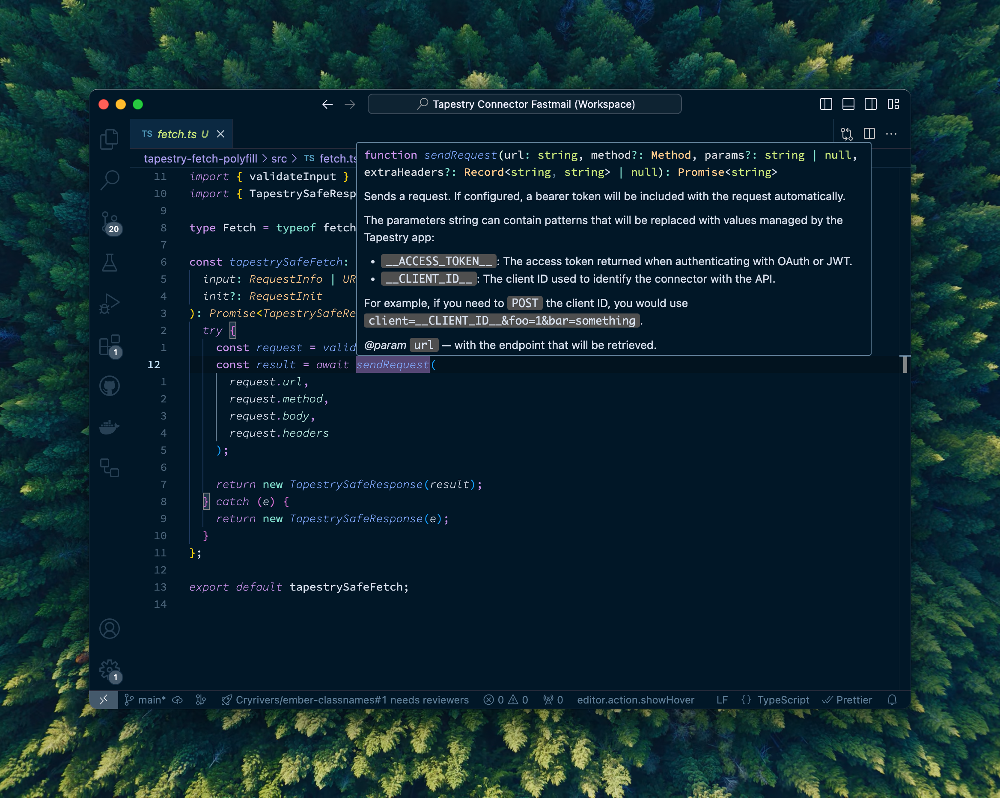

# tapestry-type-defs

This repo provides TypeScript type definitions for the [Tapestry Connector API](https://github.com/TheIconfactory/Tapestry/blob/main/Documentation/API.md). Please note that these are in no way official, accurate or up-to-date; I built them to learn their API and help myself tinker with building out Connectors. Use at your own risk!

## Installation

This packages is best consumed as a "`@types/` package", which TypeScript will automatically pull type definitions from. It is recommended that you install this package using an "alias" so that your project installs it with an `@types/`-namespaced package name:

```bash
# yarn
yarn add -D @types/tapestry-connector-runtime@npm:@alexlafroscia/tapestry-connector-type-defs@^1.0.0

# npm
npm install --save-dev @types/tapestry-connector-runtime@npm:@alexlafroscia/tapestry-connector-type-defs@^1.0.0
```

## Usage

With the package installed, TypeScript should automatically source types for all of the globals that Tapestry provides!



If you're using this package to provide type definitions for a `plugin.js` (rather than a `plugin.ts` that you intend on processing) it might be useful to annotate the types for the `load` and `verify` functions, so that TypeScript sources the types correctly:

```diff
+ /**
+  * @type {import("@types/tapestry-connector-runtime").Verify}
+  */
function verify() {
    // Your `verify` contents
}

+ /**
+  * @type {import("@types/tapestry-connector-runtime").Load}
+  */
function load() {
    // Your `load` contents
}
```

However, this shouldn't be strictly necessary; TypeScript should discover the global types for you even without this!
